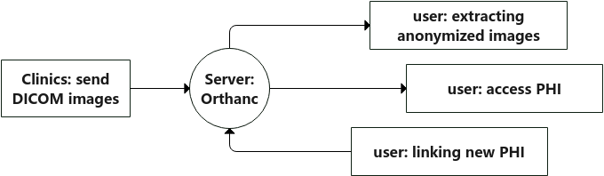
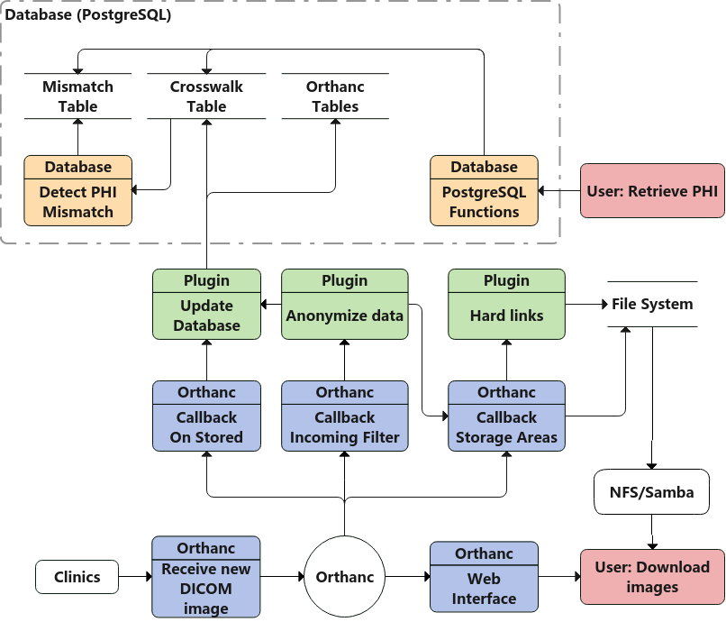

# Requirements and Design Report

## High-level description

We are tasked with developing a plugin that extends the open-source Picture Archive and Communication System (PACS) server [Orthanc](https://www.orthanc-server.com/). The plugin should have the ability to extract and de-identify incoming DICOM files, generate traceable patient information, store the corresponding data and remove any intermediate raw PHI.

## User groups

Medical Research Managers are expected to be the main user group for this plugin and pipeline. The anonymized DICOM files can be used by researchers to train future Artificial Intelligence models, and the patient information can be used to verify the accuracy of the AI models.

Medical IT Staff will also be interacting with our pipeline. They are expected to maintain and manage the pipeline. IT Staff will have the knowledge to query the database system to retrieve information needed by researchers.

## Overview of data flow diagrams

### Level 0 Data Flow Diagram

### Level 1 Data Flow Diagram

## Milestone requirements

### Peer Testing #1
The first peer testing will occur on November 14, 2021. For this first peer testing session, we are planning on having the following functional requirements ready for user feedback:
- Receive DICOM files from medical modalities via DICOM protocol.
- Store incoming DICOM files with anonymized PHI.
- Store retrievable PHI using the anonymized DICOM file's UUID.

### Peer Testing #2
The second peer testing will occur on March 2-4, 2022. For the second peer testing session, we are planning on having the following functional requirements ready for user feedback:
- Identify potential PHI mismatches.
- Read PHI from the database.
- Download DICOM files en masse.

### Final Product
The final product and deliverables are due on April 22, 2022. We are planning on having the following functional requirements ready:
- Download PHI as CSV.
- Filter PHI from the database.
- Filter DICOM files for download.
- Link new PHI to existing records.
- Organize DICOM files in the file system.

## Functional Requirements
- Receive DICOM files from medical modalities via DICOM protocol.
- Store incoming DICOM files with anonymized PHI.
- Store retrievable PHI using the anonymized DICOM file's UUID.
- Identify potential PHI mismatches.
- Read PHI from the database.
- Download PHI as CSV.
- Download DICOM files en masse.
- Filter PHI from the database.
- Filter DICOM files for download.

**Extras**

- Link new PHI to existing records.
- Organize DICOM files in the file system.

## Non-functional requirements & environmental constraints

**Security**: PHI must be securely stored and protected from unauthorized access.

**Reliability**: Must be able to reliably receive and process DICOM files with minimal downtime.

**Maintainability**: IT admins need to be able to manage and maintain the pipeline without needing to modify code. So there should be adequate documentation for building, installing, and configuring the pipeline.

**Usability**: The pipeline should be user-friendly and accessible.

### Environmental Constraint

To comply with HIPAA (Health Insurance Portability and Accountability Act), all components of the pipeline must be within BC Cancer's security network. This limits our options for our system architecture as we won't be able to use established cloud services like AWS and Azure to handle computing, database, and storage. In addition, due to limited funding, the server infrastructure that we'll be working with won't be as powerful as we would like. We'll have to optimize our pipeline to be as efficient as possible to handle the large amount of data (125GiB/day) that we need to process.

## Tech stack

### Dependencies
First and foremost this project [creates an Orthanc plugin](https://book.orthanc-server.com/developers/creating-plugins.html#structure-of-the-plugins) in C++, so the Orthanc [plugin SDK](https://sdk.orthanc-server.com/index.html) is required. Which is available as [OrthancCPlugin.h](https://hg.orthanc-server.com/orthanc/file/Orthanc-1.9.7/OrthancServer/Plugins/Include/orthanc/OrthancCPlugin.h)
#### Tools
* GCC - compiler (C/C++ languages)
* Cmake compatible build system (eg. GNU Make, Ninja)
* Cmake 3.20 - configures build system
* Docker - local testing ([docker image](https://hub.docker.com/r/jodogne/orthanc-plugins))
* Github Actions - remote testing
* CLion (recommended)

#### Submodules
| Library | Purpose | URI |
|---------|---------|-----|
| [libpq](lib) | PostgreSQL API | <ul><li>[external repo](https://github.com/postgres/postgres.git) <li>[docs - configure/build/install](https://www.postgresql.org/docs/14/install-procedure.html) |
| [libpqxx](lib) | libpq wrapper | <ul><li>[external repo](https://github.com/jtv/libpqxx.git) <li>[docs - API](https://libpqxx.readthedocs.io/en/stable/a01382.html) |
| [nlohmann/json](lib) | json API | <ul><li>[external repo](https://github.com/nlohmann/json.git) <li>[docs - integration](https://github.com/nlohmann/json#integration) <li>[docs - API](https://nlohmann.github.io/json/api/basic_json/) |
| [googletest](lib) | unit testing | <ul><li>[external repo](https://github.com/google/googletest.git) |

## Testing

We have decided on using a combination of Google Test Framework and Github Actions to implement our testing software suite. There are three parts to our testing strategy: Unit Testing, Integration Testing, and System Testing. The first two come together in our passive regression testing approach that ensures new additions to the develop and master branchs work as expected. While the third will be active testing sessions to identify weak points in the plugin that need to be fixed or imporved.
