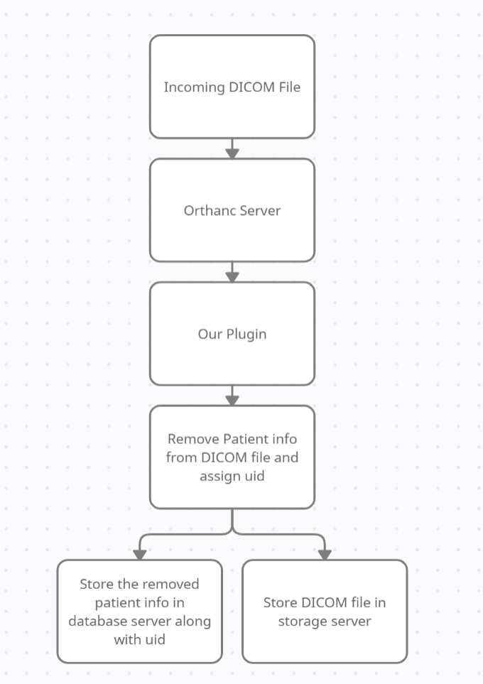

# Requirements and Design Milestone

## High-level description

We are tasked with developing a plugin that extends the open-source Picture Archive and Communication System (PACS) server [Orthanc](https://www.orthanc-server.com/). The plugin should have the ability to extract and de-identify incoming DICOM files, generate traceable patient information, store the corresponding data and remove any intermediate raw PHI.

## User groups

### Medical researchers

Medical researchers are expected to be the main user group for this software. The anonymized DICOM files and patient data can be used by researchers to train future Artificial Intelligence (AI) projects. The plugin must be able to automatize work that was previously done manually so as to make it as easy as possible for researchers to query large datasets of medical records.

## Overview of data flow diagram

## Milestone requirements 

WIP

## Non-functional requirements & environmental constraints

WIP